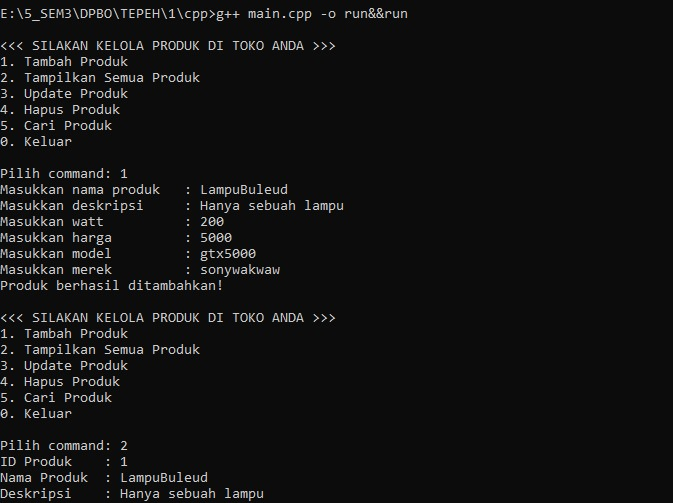

=============================JANJI============================

Saya nama Nafis Asyakir Anjar dengan Nim 2407915 mengerjakan tugas praktikum 1 dalam mata kuliah Desain dan Pemrograman Berorientasi Objek untuk keberkahan-Nya maka saya tidak akan melakukan kecurangan seperti yang telah di spesifikasikan Aamiin.

=============================DESAIN===========================

Saya membuat kelas produk elektronik sesuai dengan tema tugas yang diberikan yaitu toko elektronik. Kelas ini memiliki 6 atribut yang menurut saya penting untuk dimiliki yaitu:
1. Kode             (Untuk memastikan setiap produk unik)
2. nama_produk      (setiap produk pasti memiliki atribut nama)
3. merek            (setiap produk pasti berasal dari merek tertentu)
4. watt             (produk elektronik pasti menggunakan watt)
5. harga            (sebuah produk yang dijual pasti memiliki harga)
6. deskripsi        (deskripsi produk adalah wajib)

============================FLOW CODE==========================

==============CPP===============

---------Struktur program-------
1. ProdukElektronik.cpp 
    Berisi definisi class berupa atribut dan method
2. main.cpp 
    Berisi vector<ProdukElektronik> alias array sebagai wadah list produk
    Implementasi menu CRUD

==============JAVA==============

=============PYTHON=============

==============PHP===============
